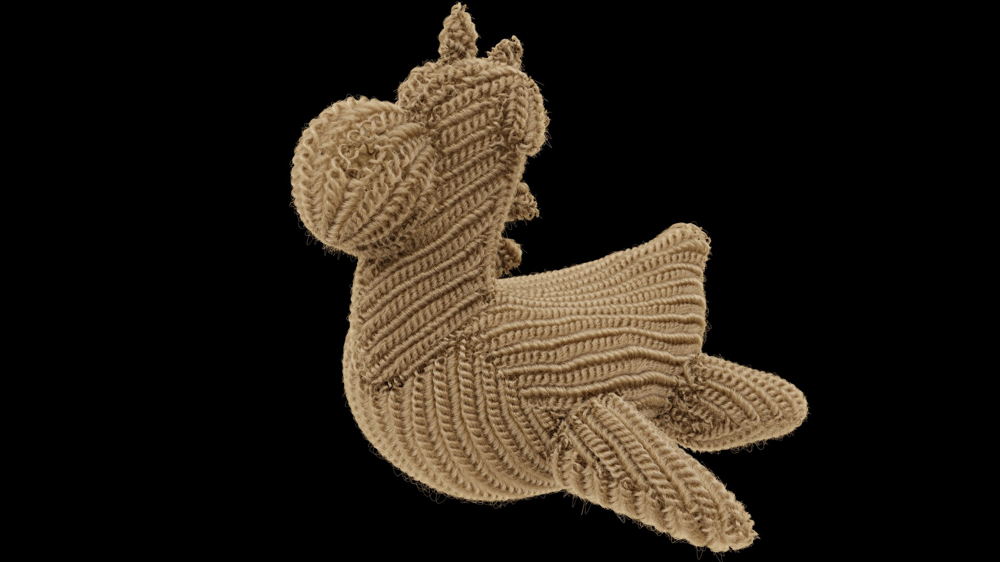

# MarkDown Manual

- ## Overview

- ## Headings

- ## Paragraphs

- ## Lists

- ## Images

    ##### To add an image, add an exclamation mark (!), followed by alt text in brackets, and the path or URL to the image asset in parentheses. You can optionally add a title in quotation marks after the path or URL.

    *Example 1:*
        
        
    
    *Result:* 
    
    

    *Example 2:*
        
        
    
    *Result:* 
   

- ## links

